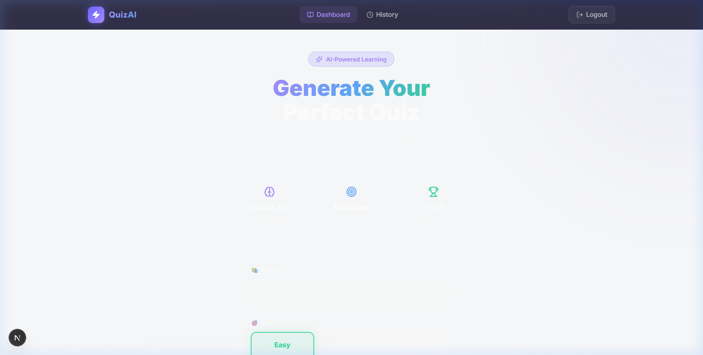
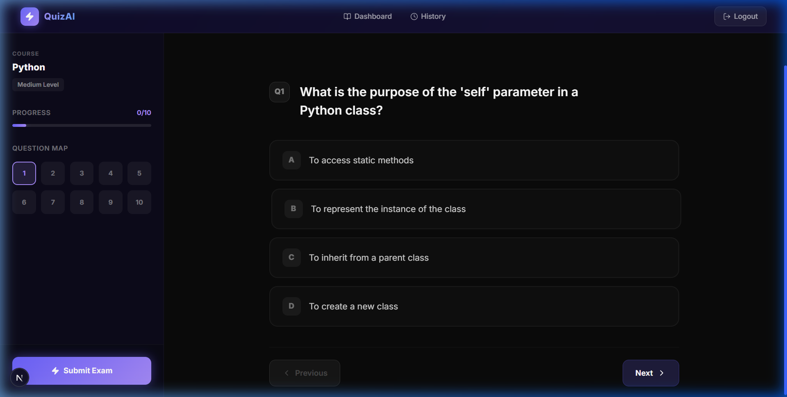
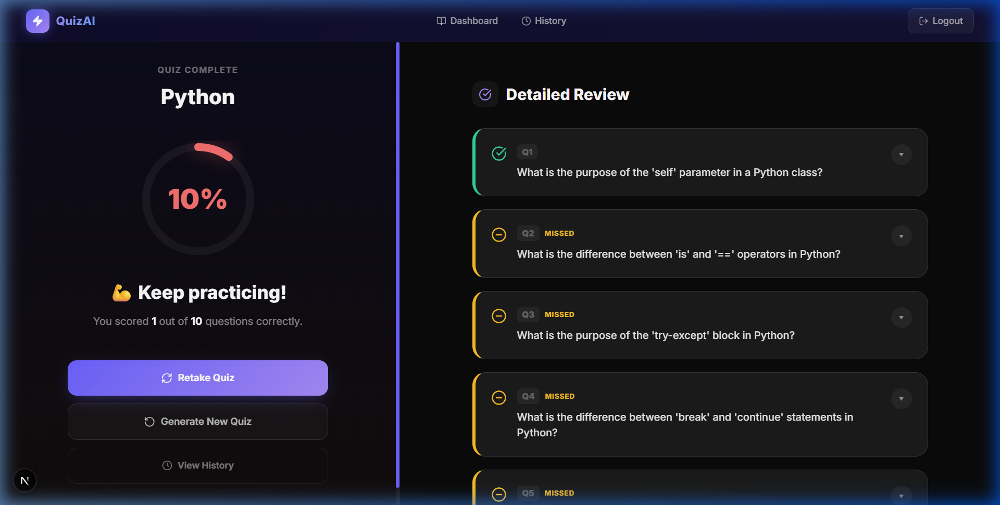
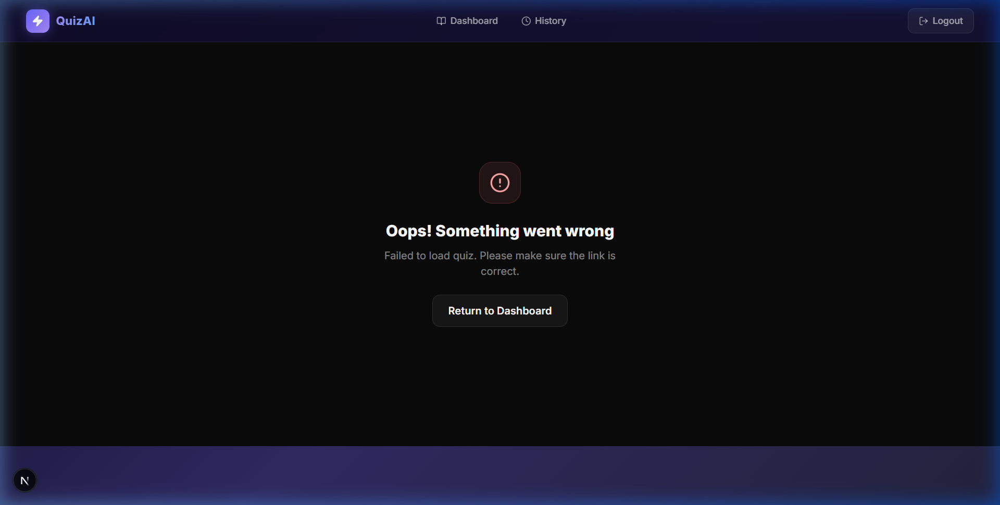

# Lumina: AI-Powered Learning 🌑✨

**Lumina** is a premium, fullstack application that allows users to generate personalized quizzes using AI, take them, and track their performance. This project satisfies all core requirements and explicitly includes advanced "Wow" enhancements tailored for EdTech usability (like AI-driven answer explanations, loading states, and robust error handling).

**Live Frontend**: [https://quizai-six-gray.vercel.app/](https://quizai-six-gray.vercel.app/)  
**Live Backend**: [https://quiz-backend-l93v.onrender.com/](https://quiz-backend-l93v.onrender.com/)

## Tech Stack
- **Frontend**: Next.js (Pages Router), Tailwind CSS, Axios, Lucide React
- **Backend**: Django, Django REST Framework, SimpleJWT
- **Database**: PostgreSQL (via `psycopg2`)
- **AI Integration**: Groq API (LLaMA3.3, `llama-3.3-70b-versatile` model)

---

## 📷 Screenshots

### Premium Dashboard


### Quiz Interface


### Results with "Missed" Scaling


### Graceful Error Handling


---

## How to Run Locally

### 1. Database Setup
Ensure you have PostgreSQL running locally with default credentials:
- DB Name: `postgres`
- DB User: `postgres`
- DB Pass: `postgres`
- Port: `5432`

### 2. Backend Setup
```bash
cd quiz-backend
python -m venv venv
# Activate the virtual environment: 
# Windows: .\venv\Scripts\activate 
# Mac/Linux: source venv/bin/activate
pip install -r requirements.txt # (or install via pip directly: django djangorestframework psycopg2-binary python-dotenv groq django-cors-headers djangorestframework-simplejwt)

# Make migrations (the models for users and quizzes)
python manage.py makemigrations users quizzes
python manage.py migrate

# Run the Django REST Server
python manage.py runserver
```

> **Note**: An `.env` file should be present in `quiz-backend` containing your `GROQ_API_KEY` to enable AI quiz generation.

### 3. Frontend Setup
```bash
cd quiz-frontend
npm install
npm run dev
```
Navigate to `http://localhost:3000`. You can freely register a new account on the landing page, log in, and begin generating quizzes.

---

## Architecture & Database Design Decisions

### Database Schema Structure
I opted for a clear, normalized relational database design to handle quiz generation and attempt tracking natively. Strong relationships connect the entire ecosystem seamlessly.

- **User Model**: Employs the standard Django authentication User model.
- **Quiz Model**: 
  - `user`: Foreign Key maps cleanly back to User. Features `created_at` timestamp.
  - Stores `topic`, `difficulty`, `time_limit_minutes` and `num_questions`.
- **Question Model**: 
  - `quiz`: Foreign Key explicitly tying each generated question to its parent Quiz.
  - Stores the core prompt text, correct answer, the 4 localized options, and a dynamically generated AI `explanation` block.
- **Attempt Model**: 
  - `user`: Foreign key linking the attempt to the individual.
  - `quiz`: Foreign key grouping the attempt to the specific quiz template context. Also tracks `score`, `total`, and a `completed_at` timestamp for historical analytics mapping.
- **UserAnswer Model**: 
  - `attempt`: Foreign Key connecting to the overarching Attempt.
  - `question`: Foreign Key evaluating precisely which Question this iteration binds to.
  - Stores the `selected_option`, evaluated `is_correct` boolean, and enforces an explicit `question_order` int array block.

**Why this schema?** 
By decoupling `Attempt` from `Quiz`, users can retake the exact same generated quiz multiple times without conflict. By natively linking `UserAnswer` (rather than storing a dirty JSON dump field of arbitrary answers), we elegantly snapshot precisely what the user voted for per question layout, allowing for extremely deep feedback loop reporting on the frontend.

## RESTful API Structure

I enforced a strictly compliant RESTful path design.

**Authentication Endpoints**:
- `POST /api/auth/register`
- `POST /api/auth/login` (Returns JWT Tokens securely to localStorage)

**Quiz Operations**:
- `POST /api/quiz/generate`: Hits the AI logic sequence safely, returning a validated newly persisted quiz ID payload instance upon success.
- `GET /api/quiz/history`: Renders paginated array blocks representing previously generated quizzes.
- `GET /api/quiz/<id>`: Returns the active queried quiz details.

**Attempts & Performance Modules**:
- `POST /api/quiz/<id>/submit`: Safely evaluates answers against server-side truth, increments score, creates an overarching `Attempt` row bound with nested `UserAnswer` records.
- `GET /api/attempt/history`: Yields list of historically completed attempts explicitly scoped per User.
- `GET /api/attempt/<id>` (served organically as `/api/attempt/<id>/result` internally route mapped): Deep payload breakdown merging `UserAnswer` instances with populated Contextual explanations (`explanation`) linking directly against mistakes.

---

## Challenges & AI Fault Tolerance Solutions

**1. Invalid JSON or Empty Response Payloads from AI**
*Challenge*: LLMs often arbitrarily format JSON blocks by including trailing markers, malformed arrays, or occasionally time out gracefully if load is overloaded.
*Solution*: Defensively constructed an explicit timeout payload handler parameter `Groq(timeout=20.0, max_retries=2)`. If JSON parsing fails internally via nested `try/except` mapping, the backend intentionally intercepts the server 500 block, instead defaulting to an actionable status error `{"error": "Invalid response format from AI. Please try again"}` to allow UI retry flow.

**2. Progress Perception UI Degradation**
*Challenge*: 20 unique multiple-choice LLM resolutions logically incur 2-5 seconds API processing latencies. Users will typically bail if interfaces halt unexpectedly without contextual markers.
*Solution*: Explicitly added native animated loaders binding into buttons (`Generating quiz with AI...`) ensuring UI parity matches modern user expectations. 

---

## Future Improvements: Adaptive Learning

To take this application structurally further in an EdTech ecosystem, I propose bridging the explicit normalized data layer (specifically evaluating incorrect rows dynamically sourced via `UserAnswer.is_correct == False`) natively into an **Adaptive Learning Vector Algorithm**. 

If a User attempts "Core React Hooks" continuously bypassing `useEffect` questions but cleanly scoring perfectly on `useState` blocks, the system logic should organically prepend a specific `Adaptive Focus Area Context Block` instruction constraint dynamically to the nested AI Prompt generator:
_"The User historically fails questions mapping to useEffect logic. Increase the proportional ratio of specific question focus targeting this weakness."_

This inherently mirrors enterprise-grade intelligence platform deployments leveraging learning loop integrations safely without risking systemic data loss.
